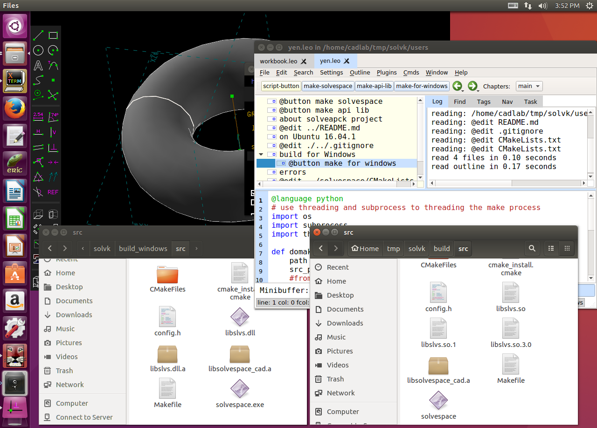

Title: 2016Fall 11/24 Solvespace
Date: 2016-11-24 14:13
Category:2016fallcadp_hw
Tags: 2016Fall w10 Solvespace 
Author: 40423104 syuan

有關 Solvespace 零件, 組件, 機構模擬等功能介紹, 程式編譯與 API 延伸
<!-- PELICAN_END_SUMMARY -->

## Solvespace

### 1. Parts (零件繪製)

範例檔案: <a href="http://solvespace.com/bracket.pl">http://solvespace.com/bracket.pl</a>

An introductory(引導性) tutorial(教程) is available(有用的), in which we draw the 'same part'(同一部分) that is shown in the 'demo video'(演示視頻). 

This covers most of the 'basic features'(基本功能) of SolveSpace, including sketches(草圖), constraints(約束), extrusions(擠出), and 'Boolean operations'(布爾運算).

When we 'first run'(運行) SolveSpace, we will begin with an 'empty part'(空的部分). Initially, our 'view of'(視圖的) the part will be 'oriented onto'(面向上) the XY plane(平面); the label(標籤) for that plane is displayed(顯示的) at the 'bottom left'(左下角) of the screen(屏幕) (#XY, in dark grey). The axes(軸) are also indicated(指示) by the three colored arrows(箭頭) at the bottom left; the X, Y, and Z axes are drawn in red, green, and blue respectively(分別地).

When we 'hover the mouse'(將滑鼠懸停) over any entity(實體), constraint, or other object(目標) in the sketch(草圖), that object will appear highlighted(突出) in yellow. For example, the XY plane, which is drawn as a dashed(虛線) square(正方形), will appear highlighted when we hover the mouse over it. The YZ and ZX planes initially(最初) look like dashed lines, because they are 'being viewed on'(正在查看) edge(邊); but they still appear highlighted in yellow when we hold the mouse over them. It is similarly(類似的) possible to highlight the X, Y, and Z axes (which are drawn as arrows), or the origin (which like all points is drawn as a green square).

翻譯:

我們提供了一個引導性教程，其中我們繪製演示視頻中表示的相同部分。

這涵蓋了 SolveSpace 的大部分基本功能，包括草圖、約束、擠出和布爾運算。

當我們首次運行SolveSpace時，我們將從一個空的部分開始。 最初，我們零件的視圖將被定向到XY平面上; 該平面的標籤顯示在屏幕的左下角（XY，深灰色）。 軸也由左下角的三個彩色箭頭指示: X、Y和Z軸分別繪製為紅色、綠色和藍色。

當我們將滑鼠懸停在草圖中的任何實體，約束或其他目標上時，該目標將以黃色突出顯示。 例如，當我們將滑鼠懸停在其上時，繪製為虛線正方形的XY平面將突出顯示。 YZ和ZX平面最初看起來像虛線，因為它們被邊查看; 但是當我們把鼠標放在他們上面時，它們仍然顯示為黃色。 同樣可以突出顯示X、Y和Z軸（以箭頭繪製）或原點（像所有點都繪製為綠色方塊）。

#### Extrude (平行長出或除料)

#### Lathe (旋轉繞行長出或除料)
<iframe src="https://player.vimeo.com/video/193886817" width="640" height="360" frameborder="0" webkitallowfullscreen mozallowfullscreen allowfullscreen></iframe>

<a href="https://vimeo.com/193886817">2016-12-01 22-41-29迴轉</a> from <a href="https://vimeo.com/user44900188">Yan syuan</a> on <a href="https://vimeo.com">Vimeo</a>.

#### 零組件繪圖練習
<iframe src="./../data/threejs/donut.html" width="800" height="600"></iframe>

<a href="./../data/w12/College_Student_Primer_Creo_2.pdf">W12 組立</a>

<iframe src="./../data/threejs/w12.html" width="800" height="600"></iframe>

<iframe src="./../data/threejs/w12.html" width="800" height="600"></iframe>

####零件繪製影片
有聲音
##方形
<iframe src="https://player.vimeo.com/video/193877932" width="640" height="360" frameborder="0" webkitallowfullscreen mozallowfullscreen allowfullscreen></iframe>

<a href="https://vimeo.com/193877932">2016-12-01 21-29-37-方形</a> from <a href="https://vimeo.com/user44900188">Yan syuan</a> on <a href="https://vimeo.com">Vimeo</a>.

##圓柱
<iframe src="https://player.vimeo.com/video/193879815" width="640" height="360" frameborder="0" webkitallowfullscreen mozallowfullscreen allowfullscreen></iframe>

<a href="https://vimeo.com/193879815">2016-12-01 21-43-52圓柱</a> from <a href="https://vimeo.com/user44900188">Yan syuan</a> on <a href="https://vimeo.com">Vimeo</a>.

##組合
<iframe src="https://player.vimeo.com/video/193883398" width="640" height="360" frameborder="0" webkitallowfullscreen mozallowfullscreen allowfullscreen></iframe>

<a href="https://vimeo.com/193883398">2016-12-01 22-14-04-組合</a> from <a href="https://vimeo.com/user44900188">Yan syuan</a> on <a href="https://vimeo.com">Vimeo</a>.

### 2. Assembly (零件組立)

<a href="http://solvespace.com/box.pl">http://solvespace.com/box.pl</a>

To start, we would like to define the orientation of the part. We can do that by locking one of the part's normals in the same orientation as one of our coordinate axes. Here, a good choice would be to constrain any of the base's normals—which are drawn as blue arrows—in the same orientation as our coordinate system's Z axis, which is also drawn as a blue arrow, in this view pointing approximately up from the origin. Select those two normals by left-clicking them, and choose Constrain → Same Orientation, or the equivalent constraint from the toolbar.

The two normals are now each marked with a magenta X, which is visible above. (It doesn't matter which of the normals on the part were chosen to constrain, since they all point in the same direction. The choice is arbitrary.) This means that those two normals are constrained to point in the same direction (i.e., parallel); but it also locks the twist of the part about that axis, so it fully constrains the part's orientation. The same-orientation constraint is useful, because it completely specifies a part's orientation with a single constraint.

We can try to drag the part's orientation and rotation now. We will find that it is still possible to translate the part anywhere, but impossible to rotate it, because that rotation is now fixed. To define the translation, we can use a point-coincident constraint. Select the two points marked in red in the image above, and choose Constrain → On Point. The two points will now be constrained to be coincident, locking the imported part's translation. The imported part is now fully constrained.

### 3. Linkages (fourbar & multilink) (四連桿與多連桿運動模擬)

四連桿:

利用線架構完成四連桿模擬後, 將 3D 零件以點重合, 點在面與點在線上約束各連桿後完成.

多連桿:  <a href="http://solvespace.com/linkage.pl">http://solvespace.com/linkage.pl</a>

### 4. Compiled & API (編譯與延伸應用)

使用 Virtualbox 虛擬主機執行 Windows 64 位元與 Ubuntu 64 位元環境中的編譯與延伸應用.

Virtualbox Ubuntu 64位元虛擬檔案: <a href="http://140.130.17.17/public/Ubuntu/1604_solvespace_final/Ubuntu_160464.vdi">http://140.130.17.17/public/Ubuntu/1604_solvespace_final/Ubuntu_160464.vdi</a> (只有在區網可以下載)

在虛擬主機中完成 Solvespace 編譯與執行的參考畫面:

